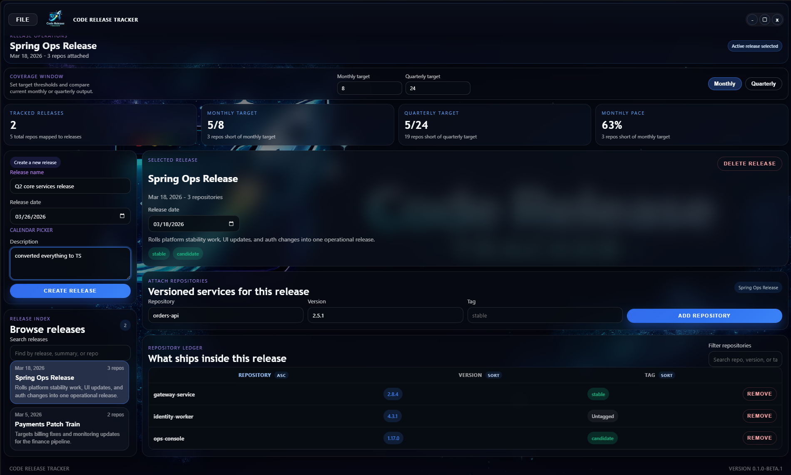

# Code Release Tracker

Code Release Tracker is an Electron desktop application for managing software releases and the repositories that ship inside them. It is built with React, TypeScript, Vite, and Electron.

<p align="center">
  
</p>

The application lets teams:

- create and track releases
- attach repositories with versions and optional tags
- monitor monthly and quarterly release coverage
- import and export tracker data locally

## Version

Current app version: `0.2.3`

For releases, keep the `package.json` version and Git tag aligned. Example: `0.2.3` in `package.json` should be released as `v0.2.3`.

## Development

Install dependencies:

```bash
npm install
```

Run the app in development:

```bash
npm run dev
```

Run linting:

```bash
npm run lint
```

Run type-checking:

```bash
npm run build
```

Note: in this environment, `npm run build` may still hit a Vite `spawn EPERM` issue when loading `vite.config.ts`. `tsc -b` and `eslint .` are the more reliable local verification commands here.

Themis tests are available through `npm run test`.
If you need to regenerate Themis coverage, run `npm run test:generate`.

## Windows Installer

Build a Windows installer `.exe`:

```powershell
npm run dist:win
```

That command runs the app build first, then packages the Electron app with `electron-builder`.

After it finishes, look in the `release` folder for:

- `Code Release Tracker Setup 0.2.3.exe`: the Windows installer
- `win-unpacked`: the unpacked app directory

To install locally, run the installer `.exe` and follow the setup wizard. You can also use the unpacked folder directly if you want to test the app without installing it.

## App Updates

Published Windows installers are stored in the repository's GitHub Releases. The app checks that release feed on startup when running from a packaged Windows build, and prompts you to restart after a downloaded update is ready.

To publish a new Windows release from CI or a tag build, use:

```powershell
npm run release:ci
```

If you just want to build the installer locally without publishing it, use `npm run dist:win`.
Do not run `npm run release:ci` locally; it is meant for GitHub Actions publishing only.

## Project Structure

- `src/App.tsx`: main application UI and state management
- `src/App.css`: application styling
- `src/index.css`: global styling and background treatment
- `electron.cjs`: Electron main process
- `preload.js`: Electron preload bridge

## Contributing

This project is open source and contributions are welcome.

If you want to contribute:

1. Fork the repository and create a focused branch for your change.
2. Keep changes scoped. Avoid mixing UI work, refactors, and behavioral changes in one patch unless they are tightly related.
3. Run verification before opening a pull request:

```bash
npm run build
npm run lint
npm run test
```

4. Include a clear summary of what changed, why it changed, and how it was tested.
5. For UI changes, include screenshots or a short screen recording.
6. For destructive actions or workflow changes, document the user impact explicitly.

## Contribution Guidelines

- Preserve existing user data behavior unless a migration path is included.
- Prefer small, reviewable changes over large rewrites.
- Keep naming consistent with the release/repository model already used in the app.
- Do not commit generated files or unrelated formatting churn.
- If you add a new feature, update this README when the workflow changes.

## Open Source Notes

- Bug reports should include reproduction steps, expected behavior, and actual behavior.
- Feature requests should explain the release-tracking use case they improve.
- Pull requests should stay implementation-focused and avoid bundling unrelated cleanup.
